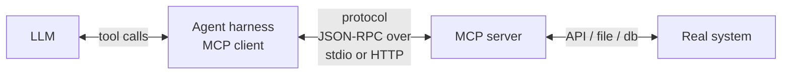

# MCP Explained

**MCP** stands for **Model Context Protocol**. It's an open protocol for connecting AI agents to tools and data sources. Think of it as USB for agents: a standard way for any agent to plug into any tool, regardless of who built either side.

## The problem MCP solves

Before MCP, every agent harness had its own way of declaring tools. If you built a tool for Claude Code, it didn't work in Cursor. If you wrote one for Cursor, it didn't work in Codex. Every integration was a one-off.

MCP defines a wire format and a set of conventions. A tool author writes one MCP server; any MCP-aware agent can use it. Switching agents doesn't require rebuilding tools.

## How it works

An MCP **server** exposes tools, resources, and prompts over a defined protocol (typically JSON-RPC over stdio or HTTP).

An MCP **client** (the agent harness) connects to the server, asks "what do you offer?", and surfaces those offerings to the LLM as available tools.

When the LLM decides to use a tool, the client forwards the call to the server, receives the result, and feeds it back into the conversation.

The protocol is the standardized middle. Everything else is implementation choice.

## Three kinds of things MCP servers expose

**Tools.** Functions the LLM can call. Each has a name, a description, an input schema, and returns a result. This is the most common use.
- `query_database(sql)` — run SQL and return rows
- `create_ticket(title, body)` — open a ticket in your tracker
- `search_docs(query)` — semantic search over documentation

**Resources.** Read-only content the agent can pull on demand. URIs identify them, the server returns content.
- `file:///etc/config.json`
- `db://users/by-id/123`
- `wiki://onboarding/getting-started`

**Prompts.** Templated prompts that the server defines, which the user or agent can invoke as a starting point. Less common, useful for opinionated workflows.

## Why this matters for engineering

Without MCP, plugging your agent into your real systems means writing custom integrations. With MCP, common integrations exist as off-the-shelf servers:

- GitHub (PRs, issues, commits)
- Filesystem (with sandboxing)
- Postgres / SQLite / other databases
- Slack / Linear / Jira
- Docs sites, web search
- Cloud providers (AWS, GCP, Azure)

You install an MCP server, configure credentials, and the agent gains the capability. No code changes to the agent.

## A concrete example

Your team uses an internal ticket system. Without MCP, an agent that needs to read or update tickets has to either:
1. Be told to use `curl` against your ticket API (works, but error-prone)
2. Have a custom tool written in each agent harness you use (works, but duplicated)

With MCP, you write one MCP server that wraps the ticket API:
- `list_tickets(filter)` → returns ticket list
- `get_ticket(id)` → returns details
- `update_ticket(id, fields)` → updates the ticket

Configure each agent harness to load that MCP server. Now Claude Code, Cursor, custom builds — all of them — can manipulate tickets through a clean tool interface.

## What MCP doesn't do

- **It doesn't make models smarter.** A bad model with great tools is still bad.
- **It doesn't enforce security.** The MCP server is responsible for auth, scoping, and safe operations. A poorly built server is still a vulnerability.
- **It doesn't manage cost.** Agents can call MCP tools enthusiastically. You still need step limits and budgets.
- **It doesn't standardize semantics.** Two `search` tools from different servers may behave very differently. Naming conventions help but aren't enforced.

## Practical guidance

- **Use existing servers when they exist.** Don't write a new GitHub MCP server — there's a good one already.
- **Write small, focused servers for your internal systems.** One server per logical system (tickets, monitoring, deployments). Don't build a "universal" server.
- **Document your tools well.** The LLM reads tool descriptions to decide when to call them. Clear, specific descriptions get better usage. "Search" is bad; "Search the engineering wiki for runbooks and onboarding docs" is good.
- **Be careful with destructive tools.** Mark them clearly in descriptions. Consider requiring an approval step before they execute (some harnesses support this natively).
- **Watch the surface area.** Every additional MCP server adds tools to the LLM's prompt. Too many tools and the model gets confused about which to use. Curate.

## Where to learn more

The protocol spec lives at the official MCP project. For implementation, most language ecosystems have SDKs (TypeScript, Python, Go). Building a basic server takes an hour. Building a robust one with auth, observability, and good error handling takes longer — but it's a one-time investment that pays off across every agent you'll ever use.

See [07-tools-and-mcp/mcp-server-patterns.md](../07-tools-and-mcp/mcp-server-patterns.md) for design patterns when building your own.
