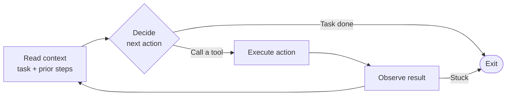

# What is an Agent

An **agent** is an LLM running in a loop with access to tools. That's the whole definition. Everything else is implementation detail.

## The loop

In words: read context → decide → execute → observe → repeat until done or stuck.

A single LLM completion is not an agent. A chatbot that answers questions is not an agent. The thing that makes it an agent is step 3 — the LLM decides to do something in the world, the world responds, and the LLM reads the response and continues.

## What "tools" means

A tool is anything the agent can call to affect the world or learn about it. Common tools:

- **Read a file** — see what's at a path
- **Write a file** — create or replace a file
- **Edit a file** — patch a section of a file
- **Run a shell command** — execute arbitrary code
- **Search code** — grep across the repo
- **Fetch a URL** — read web content
- **Call an API** — query a database, post to Slack, open a PR

The set of available tools defines what the agent can do. An agent with only "search" can answer questions. An agent with "edit" and "run shell" can change code and verify the change. An agent with "open PR" can ship to production.

This is why agent capability is mostly a function of tool design, not model intelligence. A smart model with bad tools is hobbled. An average model with the right tools can do a lot.

## What's actually happening at each step

When the agent "decides" what to do, it's making a regular LLM completion call. The prompt contains the task description, the tool definitions, and the history so far. The model emits either a text response (often a plan or explanation) or a structured tool call (`{"tool": "read_file", "args": {"path": "src/index.ts"}}`).

The harness — the code surrounding the LLM — parses the tool call, executes it, captures the result, and appends it to the conversation. Then the next completion is called with the updated history.

That's it. The "intelligence" of the agent is the model's intelligence, applied repeatedly with growing context.

## Why the loop matters

Single-shot LLM use ("here's a question, give me an answer") is limited because the model has to commit to its answer before seeing whether the answer is right. In a loop, the model can:

- **Try, observe, correct.** Run a test, see it fail, fix the code.
- **Explore before committing.** Read the codebase before proposing a change.
- **Ask clarifying questions.** Pause when ambiguous.
- **Self-verify.** Run the build, run lint, check that the change compiles.

This last property is the core leverage. An agent that runs its own tests catches its own mistakes. A single completion can't.

## Where agents fail

- **Loops with no progress.** The agent keeps trying the same approach, getting the same error, trying again. Good harnesses detect repeated failures and break the loop.
- **Hallucinated tools.** The model invents a tool call that doesn't exist. Harnesses should reject and explain rather than crash.
- **Drift from the task.** Long conversations accumulate context that pulls the agent off-track. See [context-and-memory.md](./context-and-memory.md).
- **Overconfidence at boundaries.** The agent doesn't know where its knowledge ends. It will confidently misuse an unfamiliar API. Specs and tests pin this down. See [trust-and-specs.md](./trust-and-specs.md).
- **Cost runaway.** A loop that doesn't terminate is a billing problem. Hard step limits and budget caps are non-negotiable.

> **War story — when "generic" isn't.**
> While building a cross-project synthesis from a personal reference library, I assembled what was supposed to be a *generic* agent-patterns distillation by reading book INSIGHTS and pulling out the durable lessons. Months later, when the document was reused for unrelated work, the new context immediately surfaced what I'd missed: the "generic" doc was riddled with implicit references to the original project — "X recommendation:", "Y mapping:", framing assumptions baked into examples. The model picked up the project's vocabulary as if it were universal.
>
> The lesson: agent-authored content carries the context of the session it was authored in, even when you ask for it to be generic. If a doc is supposed to be portable, you have to *strip and re-read it from a fresh session* with no shared context — that's the only way to find the assumptions you embedded without noticing.

## How agents differ from each other

When people talk about different agents (Claude Code, Codex, Aider, Cursor, custom builds), they usually differ along these axes:

- **Which model** is the brain (Claude, GPT-5, Gemini, local model).
- **Which tools** are wired up (file ops, shell, web, MCP servers, custom).
- **What context** is loaded by default (project files, conventions, system prompts).
- **What guardrails** are in place (sandboxing, approvals, dry-run modes).
- **What interface** drives it (CLI, IDE, web, API).

Two agents using the same model but different tools and context will behave very differently. This is why "which agent" is often less important than "how it's set up."

## The simplest useful mental model

For most engineering tasks, picture a junior engineer with:
- Decent technical knowledge
- A working laptop with all the tools
- No memory of yesterday
- A tendency to be overconfident
- Infinite patience and zero ego

That's roughly what you're directing. The same things that make a junior engineer effective — clear task descriptions, good local tooling, code review, a culture of running tests — make agents effective.
