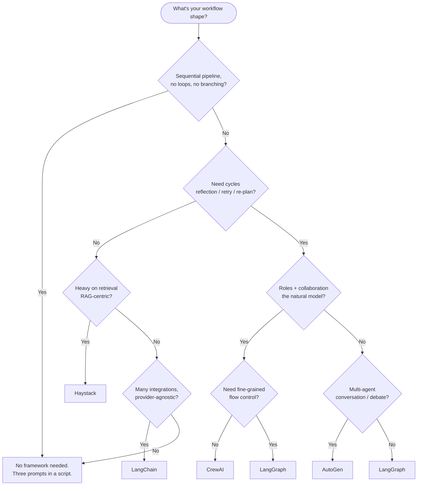

# Framework Selection

Multi-agent workflows can be implemented with no framework at all — three sequential prompts in a script is a working plan/execute/judge implementation. But once your workflows have cycles, conditional branching, persistent state, or more than a handful of agents, a framework starts to pay back.

This page is the decision matrix. For deeper evaluation of each framework as a *tool to commit to*, see [08-resources/tool-evaluations.md](../08-resources/tool-evaluations.md). This page is about *which framework fits which workflow shape*.

## The frameworks

The serious contenders, with their structural differentiators:

| Framework | Structural model | Cycles | State model | Best at |
|-----------|------------------|--------|-------------|---------|
| **LangGraph** | Typed state graph | ✅ Yes | TypedDict / Pydantic, explicit reducers | Stateful flows with feedback loops, reflection, conditional re-routing |
| **CrewAI** | Role-based agents + tasks | Limited | Per-agent memory, shared task context | Role-specialized collaboration where the structure is "team of personas" |
| **AutoGen** | Conversation between agents | ✅ Yes (via conversation) | Conversation history | Multi-agent dialogue, debate, negotiation |
| **LangChain** | Chains of components | DAG only | Chain memory, varies | Integration-heavy workflows, broad provider support |
| **Haystack** | Pipeline graph | Limited | Pipeline state | Retrieval-augmented workflows, search, document QA |
| **No framework** | Hand-rolled | Whatever you build | Whatever you build | Simple sequential workflows, prototyping |

## The single most important question: do you need cycles?

This is the load-bearing axis. Most other framework differences are noise; this one isn't.

**A DAG (directed acyclic graph)** is one-way: every edge points forward, you visit each node at most once. Pipelines are DAGs. Most early LangChain workflows are DAGs.

**A graph with cycles** can loop back. You can visit the same node multiple times with updated state. Reflection (`generate → reflect → generate`), retry-on-failure, re-planning, iterative refinement — all of these require cycles.

**You cannot implement genuine agentic behavior without cycles.** You can only implement pipelines. If your workflow can be drawn as a flowchart that never loops, you don't need cycles. If it can't, you do.

LangGraph is the canonical cycle-supporting framework. AutoGen supports cycles structurally (through agent conversation rounds). CrewAI has limited cycle support via task replay. LangChain's classic chains are DAGs; LangGraph (same family) is the cycle-supporting evolution.

If you only ever need DAGs, the framework choice is much less constrained. If you need cycles, you've narrowed the field substantially.

## Decision tree

## When each framework is the right pick

### LangGraph

**Reach for it when:**
- You need cycles (reflection loops, retry-on-failure, conditional re-routing)
- You want explicit, typed state schemas across the graph
- You need checkpointing for resumable long-running workflows
- The workflow is stateful and the state shape matters

**Look elsewhere when:**
- Your workflow is a simple linear pipeline (overkill)
- You don't want the ceremony of typed state + reducers + conditional edges
- You need a different paradigm entirely (e.g., conversation-as-flow, role-based)

**Sweet spot:** any agentic workflow with a feedback loop. Plan/execute/judge implemented in LangGraph is roughly canonical.

### CrewAI

**Reach for it when:**
- "Team of specialists collaborating" is the natural mental model for your problem
- You're prototyping multi-agent workflows quickly
- You want a low-ceremony API
- The role-based abstraction (`researcher`, `writer`, `editor`) genuinely fits

**Look elsewhere when:**
- You need fine-grained flow control beyond what role-and-task provides
- You need cycles for serious reflection loops
- Your workflow is irregular enough that "roles" don't map cleanly

**Sweet spot:** structured collaboration patterns where the agents have clear, distinct responsibilities and the workflow is mostly forward-flowing.

### AutoGen

**Reach for it when:**
- The natural shape is multi-agent dialogue (debate, negotiation, role-play, brainstorming)
- You want strong support for agent-agent communication patterns
- The work emerges from the conversation rather than executing a defined plan

**Look elsewhere when:**
- You need deterministic pipelines with predictable steps
- Your agents don't really "converse" — they hand off written artifacts
- You need tight orchestration control over which agent runs when

**Sweet spot:** problems that genuinely benefit from agent-agent conversation as the work mechanism. Many engineering problems don't.

### LangChain (classic)

**Reach for it when:**
- You need an integration that exists in LangChain's ecosystem and not elsewhere
- You're learning the field and want a tour of the available primitives
- You're maintaining existing LangChain code
- Your workflow is DAG-shaped and broad provider support matters more than minimal abstraction

**Look elsewhere when:**
- You're starting fresh and the integration list isn't a deciding factor
- The framework's surface area is more than your problem warrants
- You need cycles (use LangGraph instead — same family)

**Sweet spot:** integration-heavy DAG workflows where you'd otherwise be writing a lot of provider glue code. The framework's value is the integration count.

### Haystack

**Reach for it when:**
- RAG is the central use case
- You want retrieval, indexing, ranking, and chunking treated as first-class concerns
- Your workflow is search/QA/document-understanding shaped

**Look elsewhere when:**
- You're building general agentic workflows where RAG is one component, not the center
- The pipeline-graph abstraction is too narrow for your needs

**Sweet spot:** RAG-centric workflows where you want the framework to handle the retrieval craft for you.

### No framework

**Reach for it when:**
- The workflow is short (3-5 steps), linear, and you can read the whole thing in one screen
- You're prototyping and don't yet know the right abstraction
- You don't want to commit to a framework's lifecycle and lock-in

**Look elsewhere when:**
- The workflow has cycles, branching, or persistent state worth preserving
- You're maintaining the workflow across multiple developers
- You need the operational features (checkpointing, observability) that frameworks bundle

**Sweet spot:** a script. Genuinely, for many workflows, a script is the right answer — and many teams over-engineer this layer.

## Multi-framework pragmatics

Some teams compose frameworks: CrewAI for a role-based sub-workflow, LangGraph for the outer feedback loop, LangChain for retrievers. This works in principle and is messy in practice. Each framework has its own state model, its own assumptions, its own update cadence. Composing them produces friction at every boundary.

Default to one framework per workflow. If you find yourself wanting two, that's signal that either (a) the framework you picked is too narrow, or (b) the workflow should be split into two workflows that pass artifacts between them.

## Switching costs

Frameworks bake themselves into your code over time. Switching from LangGraph to CrewAI mid-project is a substantial rewrite, not a config change. This is true of any framework in this category.

Pragmatic defenses:
- **Keep your business logic in plain functions**, not framework-specific decorators. The framework should orchestrate; the work should be portable.
- **Define state as plain TypedDicts or Pydantic models**, not framework-specific state types where possible.
- **Keep tool definitions in MCP servers**, not embedded in framework-specific tool objects. MCP is the portable layer; framework integration is the wrapper.

If you do all three, switching frameworks is "rewrite the orchestration layer" rather than "rewrite everything."

## Framework-free baseline

Before reaching for any framework, run this thought experiment:

1. Could I implement this as N sequential LLM calls in a script?
2. Could I implement this as a small state machine with explicit transitions?
3. Does the workflow actually have the structural feature (cycles, conversation, retrieval pipelines) that justifies the framework?

If the answer to (3) is "no" and (1) or (2) is "yes," skip the framework. The hand-rolled version is shorter, easier to debug, and easier to reason about.

The framework is justified when the *structural* features it provides — cycles, typed state, checkpointing, conversation orchestration — are things you'd otherwise be reinventing badly. If you're using a framework just for "the convenience of having one," you're paying complexity tax for unused capability.

## See also

- [reflection-loops.md](./reflection-loops.md) — the canonical cycle-requiring pattern; LangGraph's natural use case
- [agent-council.md](./agent-council.md) — multi-perspective debate; AutoGen's natural use case
- [plan-execute-judge.md](./plan-execute-judge.md) — works in any framework or none
- [08-resources/tool-evaluations.md](../08-resources/tool-evaluations.md) — deeper evaluation of each framework as a tool commitment
- [08-resources/ecosystem-and-plugins.md](../08-resources/ecosystem-and-plugins.md) — broader ecosystem map including these frameworks

---

*Snapshot: May 2026. Patterns are durable; specific tool names, model versions, and provider behaviors are point-in-time. See [CHANGELOG](../CHANGELOG.md).*
