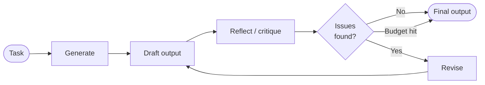

# Reflection Loops

The single most under-applied agentic pattern. A reflection loop is just: generate an output, critique that output, revise based on the critique, repeat until the critique stops finding issues (or you hit a budget). It's a tiny structural change that produces noticeably better output than single-pass generation.

This page covers the pattern in isolation. In practice, reflection often shows up *inside* other patterns — see [plan-execute-judge.md](./plan-execute-judge.md), where the judge role is essentially externalized reflection, or [agent-council.md](./agent-council.md), where the council members reflect on each other's positions.

## The pattern



Three steps:

1. **Generate** — produce a first-pass output for the task.
2. **Reflect** — read the output and produce a critique. What's wrong, what's missing, what's weak.
3. **Revise (or stop)** — if the critique is substantive, revise and loop. If the critique says "looks good" or you hit your iteration budget, stop and return.

The whole pattern is structural. The model doing the work doesn't change. The prompts at each step do.

## Why this works

Single-pass generation forces the model to commit to an answer before having seen the answer. The model has no internal critic at generation time. By the end of the response, it can sometimes tell its own output is weak — but it's already produced it, and most harnesses just return whatever was generated.

Splitting generation from critique gives the model a chance to evaluate its own work *as input*, not as output. Different cognitive task. The model that critiques is the same model that generated, but it's now reading rather than producing — and the critique tends to be sharper than the original would suggest.

The revision step then has *both* the draft *and* the critique in context. It's a much better starting point than the original prompt alone.

## What it's good for

- **Code that has correctness criteria** — generate code, run it (or critique against the spec), revise. The critique is usually right about the bug.
- **Long-form writing** — generate a draft, critique structure and prose, revise. The critique catches both content gaps and stylistic weaknesses.
- **Plans and specs** — generate a plan, critique for missing edge cases or unstated assumptions, revise. Reflection catches gaps that single-pass planning consistently misses.
- **Any task where the cost of being wrong is higher than the cost of an extra LLM call** — which is most non-trivial agentic work.

## What it's NOT good for

- **Trivial tasks.** Renaming a function. Reflection adds latency and cost for no quality gain.
- **Tasks with no clear evaluation criteria.** If the critique can't decide what "wrong" looks like, reflection just rephrases.
- **Tasks where the model lacks the underlying knowledge.** Reflection makes a model better at applying what it knows; it doesn't add knowledge it doesn't have. A model that's wrong because it's confidently misinformed will reflect *also* confidently misinformed.

## Implementation: the simplest version

You can run reflection in a single agent, three sequential prompts, no framework:

```
Prompt 1 (generate):
  "Implement <task>."

Prompt 2 (reflect):
  "Here is your draft: <draft>.
   Critique it against the original task. What's missing?
   What's wrong? What's weak? Be specific."

Prompt 3 (revise):
  "Based on this critique: <critique>
   Revise your draft. Address each specific point."
```

That's it. Three sequential calls in the same conversation produce noticeably better output than one call. You can stop here for most purposes.

## Implementation: a graph framework version

When you want the reflection cycle to be a real loop with conditional termination, frameworks that support cycles (LangGraph being the canonical one — see [framework-selection.md](./framework-selection.md)) make it explicit:

```python
def generate(state):
    return {"draft": llm.invoke(state["task"])}

def reflect(state):
    critique = llm.invoke(f"Critique this draft: {state['draft']}")
    return {"critique": critique, "iterations": state["iterations"] + 1}

def should_continue(state):
    if state["iterations"] >= MAX_ITERATIONS:
        return "done"
    if "no issues" in state["critique"].lower():
        return "done"
    return "generate"  # loop back

graph = StateGraph(...)
graph.add_node("generate", generate)
graph.add_node("reflect", reflect)
graph.add_conditional_edges("reflect", should_continue, {"done": END, "generate": "generate"})
```

The framework gives you state management, checkpointing, and the conditional edge that loops back. The pattern is the same as the three-prompt version; the framework just makes it executable as a real loop with explicit termination logic.

## Termination

Three termination signals, in order of preference:

1. **The critic says it's done.** Best signal when it's reliable.
2. **Iteration budget hit.** Hard ceiling. Always include this. Without it, a critic that always finds *something* wrong creates an infinite loop.
3. **No improvement detected.** Optional sophistication: hash the draft; if it doesn't change between iterations, stop.

A reasonable default: max 3-5 iterations, with iteration 1 being "generate" and the remaining being reflect+revise pairs. Most quality gain happens in the first 2 reflection cycles. Diminishing returns after that.

## Picking the critic

The critic is the single most important choice in the loop. Three options:

**Same model as the generator.** Cheapest. Surprisingly effective — the model genuinely catches things in critique mode that it produces in generation mode. Good default.

**Stronger model than the generator.** Pair a mid-tier executor with a frontier critic. Better at catching subtle issues. More expensive but higher quality. Useful for high-stakes work.

**Different model entirely.** A frontier model from a different provider. Catches a different category of errors than same-family critics. Most expensive in operational complexity (different API, different auth, different latency profile). Reserve for when multi-LLM review is the actual goal — see [multi-llm-review.md](./multi-llm-review.md).

## Common mistakes

- **No iteration budget.** The most common bug. A critic that always finds *something* wrong loops forever.
- **Vague critique prompts.** "Critique this" gets vague critique. Specific prompts ("Critique this for missing edge cases, security issues, and unclear naming") get specific critique.
- **Revising without preserving what works.** A naive revise prompt regenerates the whole output and loses good parts. Better: "Revise *only* the parts the critique flagged. Leave the rest as-is."
- **Critiquing the wrong thing.** If the spec is wrong, no amount of reflection improves the output. Reflection is downstream of clear requirements; it doesn't fix a bad spec.
- **Treating the critic as ground truth.** Critics can be wrong too. If the generator pushed back on a critique with strong reasoning, that's signal — not always proof the critic is wrong, but proof the disagreement deserves human attention.

## Cost shape

Reflection roughly doubles or triples the token cost of single-pass generation. The math:

- Single pass: 1× generation
- Reflection (one cycle): ~3× — generate, critique, revise
- Reflection (two cycles): ~5× — generate, critique, revise, critique, revise

Most of the cost is input tokens (each step carries growing context). Cache the stable parts of the prompt aggressively — see [06-token-efficiency/prompt-caching.md](../06-token-efficiency/prompt-caching.md). With caching, reflection is closer to 1.5-2× single-pass cost, not 3-5×.

The output quality difference at 2-3× cost is usually large. For non-trivial tasks, reflection is one of the highest-ROI patterns in the catalog.

## See also

- [plan-execute-judge.md](./plan-execute-judge.md) — externalized reflection: the judge role IS the critic, separated by agent boundary
- [multi-llm-review.md](./multi-llm-review.md) — reflection across providers, when even single-model reflection isn't enough
- [framework-selection.md](./framework-selection.md) — frameworks that support cycles (essential for genuine loop-with-termination)
- [06-token-efficiency/prompt-caching.md](../06-token-efficiency/prompt-caching.md) — keeping reflection affordable by caching the stable prompt prefix

---

*Snapshot: May 2026. Patterns are durable; specific tool names, model versions, and provider behaviors are point-in-time. See [CHANGELOG](../CHANGELOG.md).*
