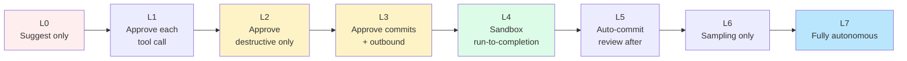

# Autonomous Control Levels

A framework for thinking about how much autonomy to give an agent. The levels aren't fixed categories; they're points on a spectrum. The right level depends on the task, the environment, and your trust calibration.

## The levels

**Level 0 — Suggest only.** The agent proposes; nothing executes automatically. You manually apply every change. Used when: very high stakes, very low trust, learning a new agent or tool.

**Level 1 — Approve each tool call.** The agent decides what to do; you approve before each action. Slow but very controlled. Used when: high stakes, some trust, exploring unfamiliar territory.

**Level 2 — Approve destructive actions only.** The agent reads, searches, runs tests freely. It pauses before file writes, shell commands, or anything irreversible. Used when: standard interactive coding for non-trivial work.

**Level 3 — Approve commits and outbound actions.** The agent edits files, runs tests, iterates locally. It pauses before commits, PRs, deployments, external API calls. Used when: trusted interactive work, well-bounded tasks.

**Level 4 — Run-to-completion in sandbox, review result.** The agent runs unattended until done. You review the output before merging. Used when: well-specified tasks, sandboxed environment, batch work.

**Level 5 — Run-to-completion with auto-commit.** The agent runs, commits its work, you review the commits. No active approval gate. Used when: high-confidence tasks, isolated branch, easy to revert.

**Level 6 — Autonomous with sampling.** The agent runs and ships continuously. You sample the output periodically rather than reviewing each piece. Used when: very high trust, well-bounded task, downstream signals will catch failures.

**Level 7 — Fully autonomous.** No human review at all. Used when: production-grade pipeline with strong automated verification (tests, canary deploys, monitoring) catching errors. Rare for engineering work; more common for narrow tasks like dependency updates.

Most teams settle at L2-L3 for interactive work and L4-L5 for batch automation. L6-L7 are rare and earned.

## Picking a level

Three factors:

**Trust.** Has this agent done this kind of task well before? New agent or new task type → lower level. Many successful runs → higher level.

**Stakes.** What happens if the agent does the wrong thing? Annoying revert → higher level. Production incident → lower level. Irreversible damage → lowest level.

**Verification.** What will catch errors? Tests, types, multi-LLM review, canary deploys, monitoring. Strong verification → higher level. No verification → lower level.

For most engineering work, the sweet spot is level 2 or 3 (interactive with approval gates). Level 4-5 is where automation lives. Level 6-7 is rare and earned.

## Level dynamics

The right level is not static. Within a single task, you might:

- Start at level 2 ("approve destructive actions") while the agent is exploring.
- Move to level 3 ("approve commits") once the plan is clear.
- Move back to level 2 if the agent surfaces something unexpected.

This is conscious adjustment, not drift. Drift is when you're at level 2 in name but in practice approving every prompt without reading. That's effectively level 4 with extra steps — same risk as level 4 with the illusion of safety.

## Level vs. environment

Level interacts with environment ([sandbox-environments.md](./sandbox-environments.md)). The same level means different things in different environments:

- Level 4 on your laptop: agent can write to anywhere on your filesystem.
- Level 4 in a container with `--network none`: agent can only modify the project directory and can't reach external services.

A high level in a small sandbox can be safer than a low level on a permissive host. Match level to environment thoughtfully.

## Common configurations

**Junior engineer pattern.** Level 2-3 interactive use. Agent does the work; you review carefully. Trust is moderate; stakes are real but not catastrophic; verification is your review.

**Overnight batch pattern.** Level 4-5 in a sandbox. Tasks are well-specified, sandbox bounds blast radius, you review the next morning. Trust is moderate-to-high; stakes are bounded by sandbox; verification is your morning review plus tests.

**Continuous improvement pattern.** Level 5-6 in a sandbox, scoped to one repo. Agent watches for opportunities, opens PRs. You review at PR-level cadence, not action-level. Trust is high for the specific task type; stakes are bounded by PR review; verification is the existing PR process.

**Autonomous CI pattern.** Level 6-7 for narrow tasks like dependency updates, security patches, automated formatting. Trust is high (because the task is narrow). Stakes are bounded. Verification is automated tests and humans reviewing PRs.

> **War story — per-task budgets are not optional at scale.**
> A reference-library extraction job — running L4 (sandbox, run-to-completion, review after) over ~150 technical books, some 20,000+ lines long — ran exactly the way it was supposed to right up until one book sent the extractor into a context-explosion loop. The book had unusual chapter formatting; the extractor didn't recognize a chapter boundary; it kept "reading more to clarify"; one book burned what would have been a quarter of the entire run's budget before the per-task ceiling killed it.
>
> The fix wasn't a smarter extractor. The fix was: a hard per-task token budget (sized to the *median* book, not the largest), a per-task time ceiling, and a cost-tagging scheme that let the next morning's review immediately flag which book had been the outlier so its INSIGHTS could be regenerated under a tighter prompt. The budget caught the runaway. Without it, one weird book would have eaten the whole run.

## Approval fatigue

A level 2 or 3 setup that asks for approval many times per minute is unsustainable. You either:
- Ratchet up to level 4 implicitly (rubber-stamping)
- Disable approvals out of frustration
- Stop using the agent

None of these is good. If approval cadence is too high, fix the underlying issue:
- Allowlist common safe operations (reading files, running tests)
- Group related actions into a single approval
- Move to level 4 with a sandbox that contains the blast radius

The goal of approvals is to surface decisions that need human judgment, not to ceremonially gate every action.

## When to ratchet down

If you've been at level 4-5 and something goes wrong — a bad commit, a wrong API call, a regression — drop back to level 2-3 for that task type. Stay there until you understand what happened and have addressed it. Only then ratchet back up.

The instinct to "trust but verify" is right. After verification reveals a problem, trust less.

## Level mismatches that bite

- **High level, weak verification.** Level 5 with no tests is just "ship whatever the agent makes." This always ends in regressions.
- **Low level, fast pace.** Level 2 used reflexively for high-volume work — you stop reading approvals. The control is theatrical.
- **Wrong level for the task.** Level 5 for a security migration is reckless. Level 2 for a sweep of typo fixes is exhausting.

The level should match the work. There's no virtue in being conservative beyond what the task warrants, and no virtue in being aggressive when the stakes don't support it.

## How to articulate this to a team

A useful conversation: "What level are we operating at for X kind of work, and why?" Not "are we using AI" — that's not specific. The level conversation reveals where the practice actually is and whether it's calibrated.

Teams that can answer this — different levels for different task types, with reasons — are operating thoughtfully. Teams that can't answer either don't know or have drifted to whatever maximizes short-term throughput, with the corresponding risks.
