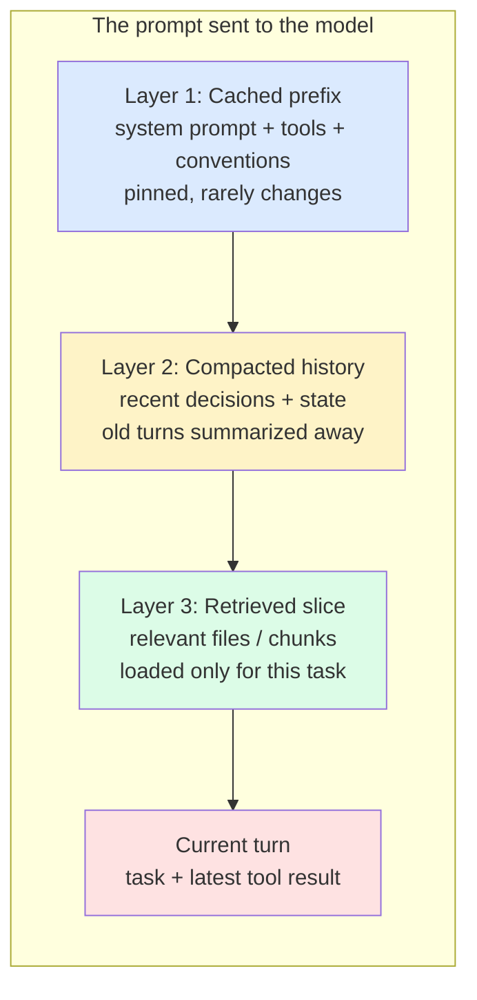

# Context Management

Context is what the agent knows when it acts. Too little and it makes uninformed decisions. Too much and it pays for content it isn't using, gets confused by irrelevant material, and exceeds the model's effective attention.

Good context management means putting the right things in the prompt, in the right order, at the right time.

## Three layers

Context management operates at three layers, each with different tradeoffs:

1. **Prompt caching.** Stable content cached at the prefix. See [prompt-caching.md](./prompt-caching.md).
2. **Event compaction.** Summarizing older session history to keep the working set bounded.
3. **Retrieval pruning.** Loading only the slice of the corpus that's relevant to the current task.

These compose. A well-managed agent uses all three.

Stable content first (cacheable). Variable content last (changes per turn). The variable parts pay full price; the stable parts ride the cache.

## Layer 1: prompt caching

The first move. Put stable content first; let it cache. Already covered — see [prompt-caching.md](./prompt-caching.md).

The summary: caching makes long context cheap if the long part is stable.

## Layer 2: event compaction

Long-running sessions accumulate history. After 50 tool calls, the conversation is 100K+ tokens of mostly noise. The agent's recent thinking is buried under stale tool output.

Compaction summarizes older history into a denser representation. Two strategies:

**Rolling summarization.** When the conversation hits a threshold, summarize the oldest N turns into a paragraph. Replace those turns with the summary. The agent loses fine detail but keeps the gist.

**Structured compaction.** Define what's worth keeping (decisions made, files modified, tests passing/failing) and what's disposable (intermediate tool output, exploratory reads). Keep the structured artifacts; drop or summarize the rest.

Structured compaction is better but requires knowing what matters. Rolling summarization is a reasonable default.

### When to compact

- **Hitting context window limits.** Forced; you must.
- **Approaching diminishing returns.** Old context isn't being referenced; carrying it costs more than the value it provides.
- **Before a long-horizon next step.** Compact before launching into deep work so the model's attention budget is on the new task, not the old one.
- **Never mid-thought.** Compact at clean breakpoints (after a task completes), not in the middle of multi-step reasoning.

### What to preserve

After compaction, the agent should still know:

- The current goal and constraints
- Decisions already made and why
- What's been tried and what failed
- Files modified and current state
- Outstanding TODOs

If the compacted summary is missing any of these, you're losing critical state.

## Layer 3: retrieval pruning

Don't load files the agent doesn't need. Don't paste 10K lines of logs when 50 lines tell the story. Don't include the whole codebase when the relevant code lives in three files.

Two approaches:

**Targeted loading.** The agent (or a router) decides what to load based on the task. "This task is about auth → load auth-related files only." Requires either good naming/structure or a search step before loading.

**Retrieval-augmented context.** Index the corpus (codebase, docs, tickets), retrieve the top-K most relevant chunks for the current task, and inject only those.

Targeted loading is simpler and works well in well-structured codebases. Retrieval works better at scale and across less-structured corpora (sprawling docs, ticket histories, transcripts).

### Where retrieval breaks

- **Code that requires structural understanding.** Retrieval gives you chunks; refactoring requires the whole file.
- **Cross-file dependencies.** A function that calls three other functions you didn't retrieve will be misunderstood.
- **Implicit context.** Conventions, design decisions, "the way we do things" — these often aren't in retrievable chunks.

When retrieval is insufficient, fall back to targeted loading or full-file context for the affected files.

## The working set principle

At any moment, the agent has a working set: the content that's actually load-bearing for the current step. Most of the time, the working set is small — a few files, the current task, a handful of recent tool results.

Aim to keep the working set tight. The total context can be larger (cached system prompt, project conventions, handoff doc) but the actively-used portion should be lean.

A bloated working set produces three failures:

1. **Higher cost** (paying for tokens not driving decisions)
2. **Slower responses** (more tokens to process)
3. **Worse decisions** (model attention spread across irrelevant content; key signals lost in noise)

> **War story — most of a book is not load-bearing.**
> A bash cookbook in the reference library is ~26,000 lines long. The synthesis distilled from it — covering the security-first script template, parameter expansion, argument handling, error trapping, and the rest of the genuinely-useful patterns — came in at ~280 lines. That's a 100× compression. The other 99% wasn't *wrong*; it was reference material, alternate phrasings, edge cases, examples of patterns the synthesis already covered once.
>
> The implication for context management: when you're tempted to load a "complete" reference into agent context, ask whether you actually need the 26,000-line version or whether the 280-line distillation would do the same job. Almost always, the distillation is enough — and the cost difference is staggering. Build the distillations *once*, then load *those* on every session.

## Common anti-patterns

- **Dumping the whole repo into context "just in case."** Expensive, slow, often hurts quality.
- **Pasting full tool output when only a few lines matter.** Especially bad for log/test output. Truncate or summarize before injection.
- **Carrying old conversation forever.** A 200-turn conversation with no compaction is not "thorough"; it's a model trying to think through a hailstorm.
- **Re-reading the same files every step.** Read once, cache, reference. Don't re-issue file reads when the file hasn't changed.
- **Loading on speculation.** "We might need this later" almost always means we don't. Load when needed.

## Patterns by workflow type

**Short tasks (single agent, < 10 steps):** prompt caching is enough. No compaction needed.

**Medium tasks (single agent, 10-50 steps):** add structured compaction at the halfway mark.

**Long-running sessions (multi-hour, multi-checkpoint):** all three layers. Plan compaction points explicitly.

**Multi-agent workflows:** each agent has its own context budget. Don't pass the whole shared history to every agent — pass the spec, the relevant artifacts, and the agent's specific role.

## Diagnosing context problems

Three signs your context strategy needs work:

1. **The agent forgets things you told it earlier.** Compaction is dropping or distorting key information. Move the dropped item to a pinned section.
2. **The agent re-reads files it just read.** Either the model isn't recognizing prior reads, or compaction is dropping them. Pin recently-read file paths.
3. **Cost grows superlinearly with session length.** Old context isn't being compacted; every step is paying for the full history. Add compaction.

Address the actual symptom, not the abstract concern. Don't compact aggressively before you have a reason — premature compaction loses information that mattered.
